# TC支付监控端

TC支付监控端是一个 Android 收款通知监控应用，主要用于学习、测试和小项目初期接入个人收款码通知。应用通过监听微信、支付宝等通知，实现收款消息采集、日志展示和状态同步。

感谢 [szvone/Vmq](https://github.com/szvone/Vmq) 和 [shinian-a/Vmq-App](https://github.com/shinian-a/Vmq-App) 两个项目的作者。本项目是在他们的代码基础上继续整理、重构和适配而来，保留了原有思路并结合当前需求做了调整。

后台协作系统可免费注册使用：[paysys.thunder-cloud.online](https://paysys.thunder-cloud.online/)。如果需要私有化部署，可以单独联系作者 [576892817@qq.com](mailto:576892817@qq.com)。

<table>
  <tr>
    <td align="center" width="25%">
      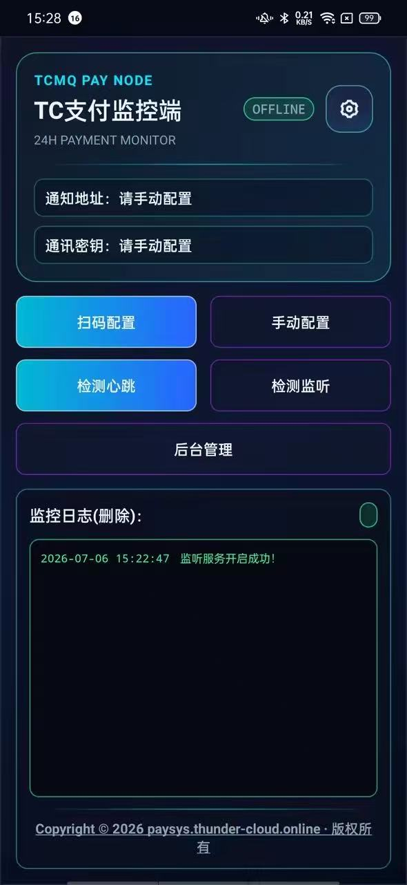
    </td>
    <td align="center" width="25%">
      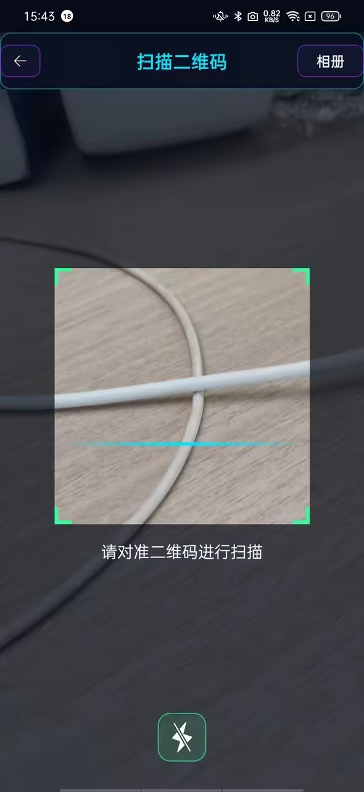
    </td>
    <td align="center" width="25%">
      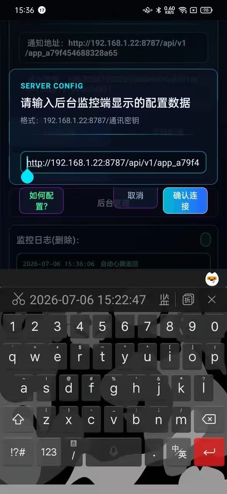
    </td>
    <td align="center" width="25%">
      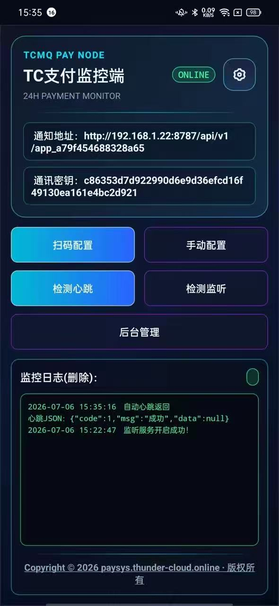
    </td>
  </tr>
</table>

## 项目特性

- 监听微信、支付宝收款通知
- 实时展示监控日志
- 支持手动配置和扫码配置
- 支持后台保活与电池优化白名单引导
- 支持帮助文档、关于页面和设置页面
- 帮助文档使用 WebView 加载在线教程

## 核心原理

### 1. 通知监听

应用核心依赖 `PayNotificationListenerService`，基于 Android 系统的 `NotificationListenerService` + `StatusBarNotification` 接收微信、支付宝等 App 发出的通知。代码入口在 `app/src/main/java/online/thundercloud/pay/service/PayNotificationListenerService.java`，核心方法是 `onNotificationPosted(StatusBarNotification sbn)`，它会读取 `Notification.extras` 里的 `EXTRA_TITLE`、`EXTRA_TEXT` 等字段，再结合包名和关键字判断是否属于收款通知。

相关 API / 类：

- `android.service.notification.NotificationListenerService`
- `android.service.notification.StatusBarNotification`
- `android.app.Notification`
- `NotificationCompat.EXTRA_TITLE`
- `NotificationCompat.EXTRA_TEXT`
- `Notification.extras`

核心代码：

```java
@Override
public void onNotificationPosted(StatusBarNotification sbn) {
    Notification notification = sbn.getNotification();
    String pkg = sbn.getPackageName();
    Bundle extras = notification.extras;
    String title = extras.getString(NotificationCompat.EXTRA_TITLE, "");
    String content = extras.getString(NotificationCompat.EXTRA_TEXT, "");

    if (shouldLogPaymentNotification(pkg, title, content, extras)) {
        logRawNotification(pkg, sbn, notification, extras, title, content);
    }

    if (PACKAGE_SELF.equals(pkg)) {
        handleSelfTestNotification(content);
        return;
    }
}
```

### 2. 收款日志处理

监听到有效通知后，程序会把消息格式化成日志字符串，通过 `MonitorLogUtils.appendRecentLog()` 写入本地 `SharedPreferences`，并刷新主界面的 `LogsTextView`。主界面在 `MainActivity` 启动时会调用 `MonitorLogUtils.keepRecentLogs()` 只保留最近 30 分钟的日志，避免数据无限增长。

相关代码：

- `app/src/main/java/online/thundercloud/pay/util/MonitorLogUtils.java`
- `MainActivity.updateMonitorLogs(...)`
- `SharedPreferences`
- `Handler` / `post(...)`

核心代码：

```java
SharedPreferences read = getSharedPreferences("items", MODE_PRIVATE);
String logsStr = MonitorLogUtils.keepRecentLogs(read.getString("logsStr", ""), MONITOR_LOG_RETENTION_MS);
SharedPreferences.Editor editor = getSharedPreferences("items", MODE_PRIVATE).edit();
logsStr = MonitorLogUtils.appendRecentLog(logsStr, msgStr, MONITOR_LOG_RETENTION_MS);
editor.putString("logsStr", logsStr);
editor.commit();
MainActivity.monitorLogHandler.sendMessage(msg);
```

### 3. 心跳与在线状态

主界面和服务会通过心跳接口与后台同步状态。`MainActivity.requestHeartbeat()` 和 `PayNotificationListenerService.initAppHeart()` 都会使用 `ServerConfigUtils.buildApiUrl()` 拼出 `/appHeart` 请求地址，再通过 `OkHttpClient` 发起 `GET` 请求。返回 JSON 后，代码会根据 `code` 和 `msg` 更新在线状态，必要时广播 `ACTION_CONNECTION_STATE_CHANGED` 让界面同步刷新。

相关 API / 类：

- `okhttp3.OkHttpClient`
- `okhttp3.Request`
- `okhttp3.Response`
- `org.json.JSONObject`
- `MainActivity.ACTION_CONNECTION_STATE_CHANGED`
- `MainActivity.setConnectionState(...)`

核心代码：

```java
String t = String.valueOf(new Date().getTime());
String sign = md5(t + parsed.secret);
String heartUrl = ServerConfigUtils.buildApiUrl(parsed.baseUrl, "/appHeart?t=" + t + "&sign=" + sign);

OkHttpClient okHttpClient = new OkHttpClient();
Request request = new Request.Builder().url(heartUrl).method("GET", null).build();
call.enqueue(new Callback() {
    @Override
    public void onResponse(Call call, Response response) throws IOException {
        JSONObject result = new JSONObject(response.body().string());
        int code = result.getInt("code");
        String msg = result.optString("msg");
        if (code == 1) {
            setConnectionState("ONLINE", Color.parseColor("#33FF99"));
        } else {
            setConnectionState("OFFLINE", Color.parseColor("#FF6B6B"));
        }
    }
});
```

### 4. 配置接入

应用支持扫码配置和手动配置两种方式。配置入口在 `MainActivity.doInput(...)` 和扫码回调里，解析逻辑集中在 `ServerConfigUtils.parse()`、`normalizeBaseUrl()` 和 `toDisplayText()`。配置文本会被拆成基础地址和密钥，供后续心跳、上报和后台管理页跳转使用。

相关代码 / API：

- `app/src/main/java/online/thundercloud/pay/util/ServerConfigUtils.java`
- `android.net.Uri`
- `TextUtils`
- `ServerConfigUtils.ParsedConfig`

核心代码：

```java
ServerConfigUtils.ParsedConfig parsed = ServerConfigUtils.parse(configText);
if (parsed == null) {
    setConnectionState("INVALID", Color.parseColor("#FF6B6B"));
    return;
}

Uri parsedUri = Uri.parse(parsed.baseUrl);
String parsedHost = parsedUri.getHost();
String t = String.valueOf(new Date().getTime());
String sign = md5(t + parsed.secret);
String heartUrl = ServerConfigUtils.buildApiUrl(parsed.baseUrl, "/appHeart?t=" + t + "&sign=" + sign);

txthost.setText(" 通知地址：" + parsed.baseUrl);
txtkey.setText(" 通讯密钥：" + parsed.secret);
host = parsed.baseUrl;
key = parsed.secret;
```

### 5. 后台保活

设置页的保活逻辑主要分布在 `SettingActivity`、`DaemonService`、`ForeService`、`NativeDaemonService`、`PlayerMusicService` 和 `SinglePixelActivity`。其中：

- `SettingActivity.service_start()` 会一次性启动前台服务、守护服务、音乐服务和 Account Sync。
- `SinglePixelActivity` 配合 `ScreenManager` 做 1 像素保活。
- `VmqApplication.createNotificationChannels()` 负责为前台/守护服务创建通知渠道，保证 Android 8.0+ 下服务能正常显示。

相关 API / 类：

- `android.app.Service`
- `startForegroundService()`
- `NotificationChannel`
- `NotificationManager`
- `AccountManager` / `SyncAdapter`
- `PowerManager.WakeLock`

核心代码：

```java
public void service_start(View v) {
    mScreenListener = new ScreenReceiverUtil(this);
    mScreenManager = ScreenManager.getScreenManagerInstance(this);
    mScreenListenerer = new ScreenStateListenerImpl(mScreenManager);
    mScreenListener.setScreenReceiverListener(mScreenListenerer);

    startDaemonService();
    startPlayMusicService();
    startNativeDaemonService();
    startAccountSync();
}
```

### 6. 教程页加载

`HelpActivity` 使用系统 `WebView` 直接加载 [paysys.thunder-cloud.online/tutorial](https://paysys.thunder-cloud.online/tutorial)。实现上通过 `WebSettings` 打开 `JavaScript` 和 `DOM Storage`，再用 `WebViewClient` 控制页面在应用内打开，避免跳出外部浏览器。

相关 API：

- `android.webkit.WebView`
- `android.webkit.WebSettings`
- `android.webkit.WebViewClient`
- `WebView.loadUrl(...)`

### 7. 状态展示

主页面会根据连接状态、服务状态和日志状态同步刷新 UI。`MainActivity` 启动时会从 `SharedPreferences` 恢复上次保存的 `host`、`key`、`logsStr` 和连接状态，然后通过 `BroadcastReceiver` 接收服务状态变化并更新界面。这样即使重启后，也能保留最近的监控上下文。

相关代码 / API：

- `SharedPreferences`
- `BroadcastReceiver`
- `Intent`
- `Handler`
- `MainActivity.normalizeLogsText(...)`

## 运行环境

- Android 5.0 及以上
- Android Studio / Gradle 构建环境
- 需要开启通知读取权限
- 建议开启自启动、后台运行和电池优化白名单

## 主要页面

- `MainActivity`：主监控页面，展示通知日志和连接状态
- `SettingActivity`：软件设置页，包含保活、常亮和帮助入口
- `HelpActivity`：教程页，通过 WebView 加载在线文档
- `AboutActivity`：关于页面，展示软件简介和版本信息

## 教程地址

在线教程地址：

[paysys.thunder-cloud.online/tutorial](https://paysys.thunder-cloud.online/tutorial)

## 使用说明

### 步骤 1：注册并登录商户后台

访问后台后先注册账号并登录，系统会自动生成默认应用。你可以在系统设置里修改应用名称，也可以在同一商户下创建多个应用，做到不同业务独立隔离。

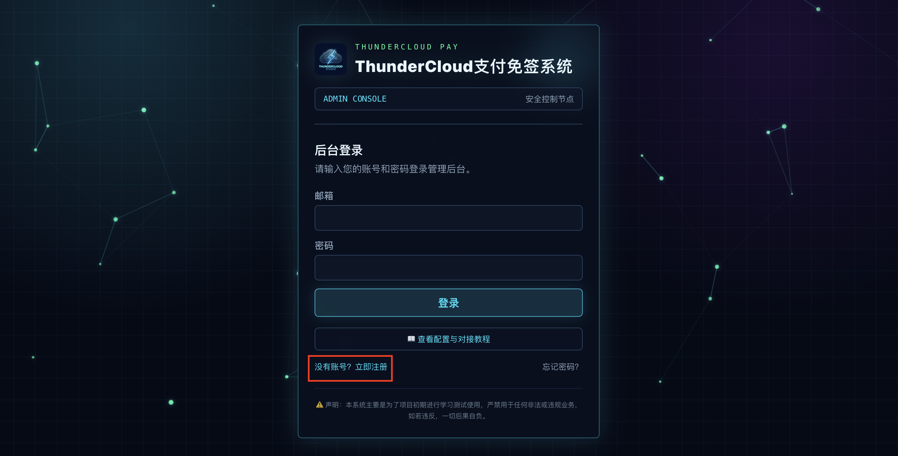
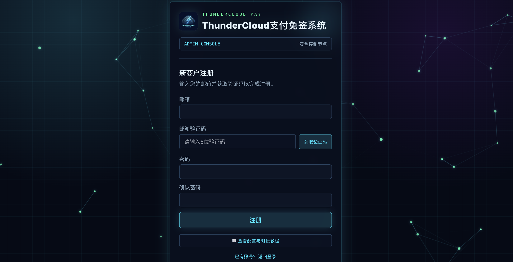
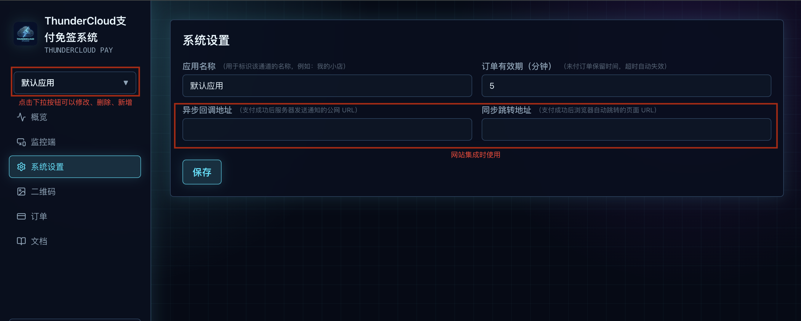

### 步骤 2：配置并绑定安卓监控端 App

1. 下载并安装安卓监控端。
2. 开启通知读取权限，允许监听微信和支付宝通知。
3. 将 App 加入电池优化白名单，并开启后台运行和自启动权限。
4. 在后台的“监控端”页面扫描绑定二维码。
5. 在 App 内发送测试心跳，后台状态显示“在线”即表示绑定成功。

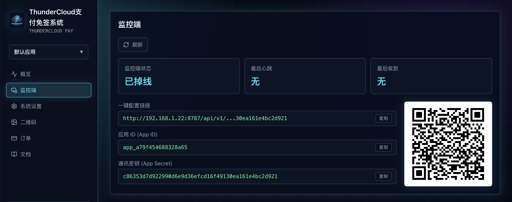

<table>
  <tr>
    <td align="center" width="50%">
      
      <br />授权通知读取权限
    </td>
    <td align="center" width="50%">
      
      <br />开启自启动与后台运行
    </td>
  </tr>
  <tr>
    <td align="center" width="50%">
      
      <br />扫码绑定客户端
    </td>
    <td align="center" width="50%">
      
      <br />发送测试心跳
    </td>
  </tr>
</table>

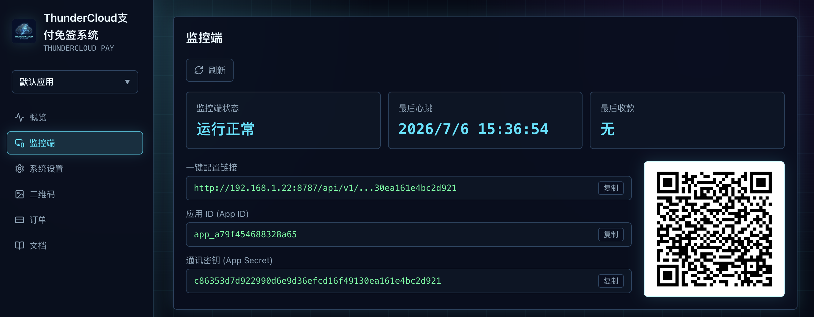

### 步骤 3：上传收款二维码

先在系统设置里配置通用收款码作为兜底，再在二维码管理里添加固定金额收款码。系统会优先匹配固定金额码，未命中时回退到通用收款码。

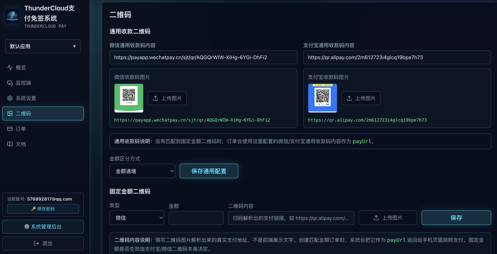
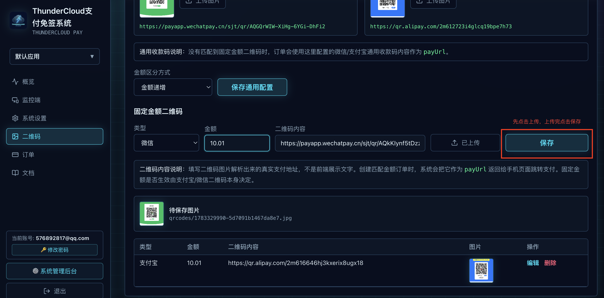

### 步骤 4：网站系统对接

在后台的文档页里找到当前应用的 `App ID` 和 `App Secret`，再把它们配置到你的网站、商城或自定义系统中。完成后，用一笔小额订单测试整个“创建订单 -> 扫码支付 -> 安卓监听 -> 后台回调”的链路。

后台管理系统可免费注册使用：[paysys.thunder-cloud.online](https://paysys.thunder-cloud.online/)。如果需要私有化部署，可以单独联系作者 [576892817@qq.com](mailto:576892817@qq.com)。

## 构建说明

Debug 包：

```bash
./gradlew :app:assembleDebug
```

Release 包：

```bash
./gradlew :app:assembleRelease
```

说明：

- `release` 构建需要正确配置签名证书密码
- 当前版本号为 `1.0.0`
- 应用包名为 `online.thundercloud.pay`

## 配置说明

应用支持两种配置方式：

- 扫码配置
- 手动粘贴配置

配置完成后，主页面会展示当前连接状态和收款日志。

## 免责声明

本项目主要用于学习和测试用途。请勿将其用于任何违反法律法规或平台规则的业务场景，相关后果由使用者自行承担。

## 许可证

本项目采用 [Apache License 2.0](LICENSE)。

你可以自由使用、修改和分发本项目代码，但需要：

- 保留原始版权声明和许可证文本
- 在修改过的文件中注明已做变更
- 不得移除第三方依赖和原作者的必要声明

本项目按 `AS IS` 提供，不附带任何形式的担保。具体条款以仓库中的 `LICENSE` 文件为准。
